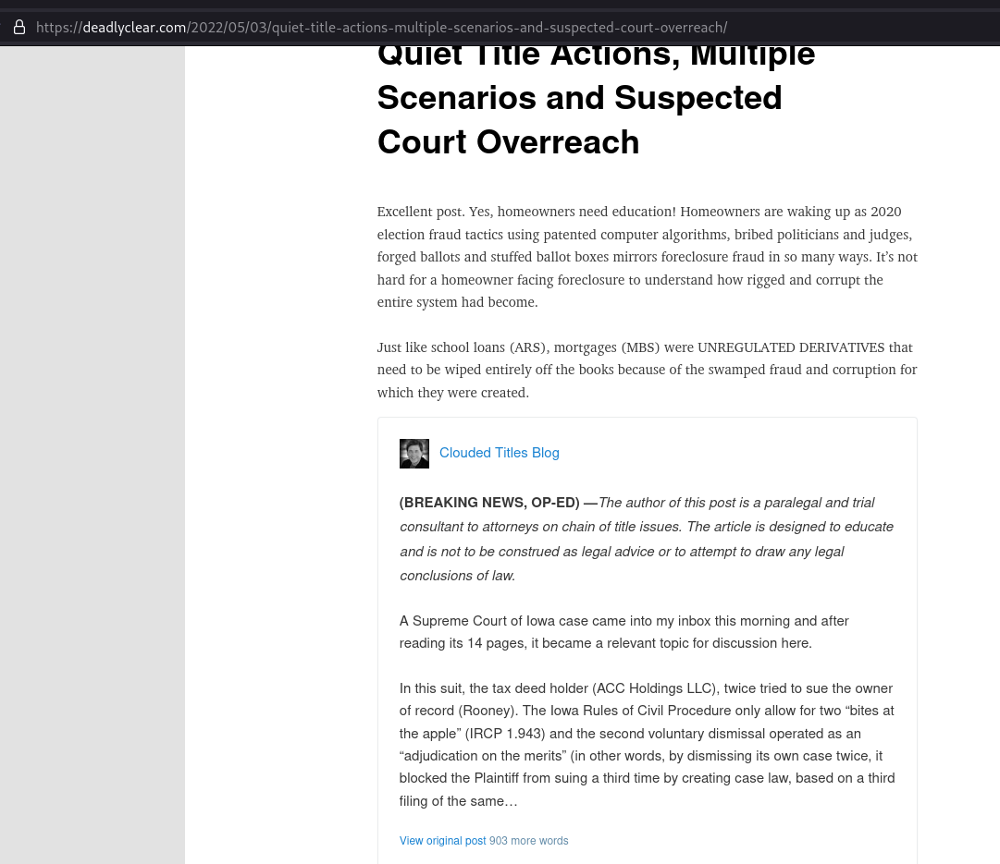
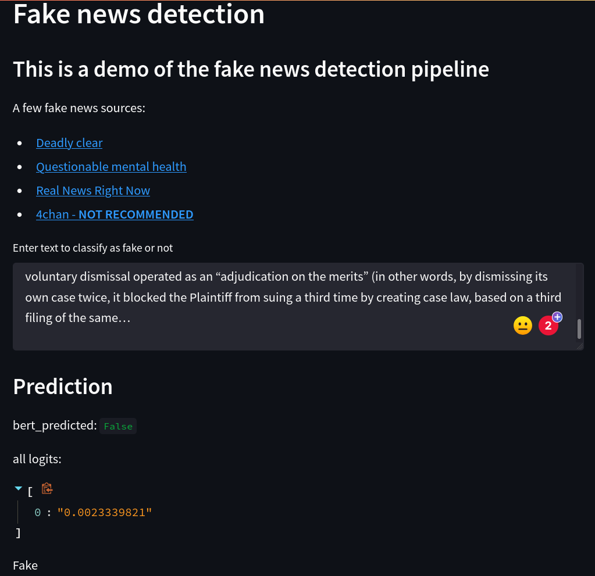

<h3> First Dataset description: </h3>
<a href="https://www.uvic.ca/ecs/ece/isot/assets/docs/ISOT_Fake_News_Dataset_ReadMe.pdf"> ISOT Fake News Dataset </a>

<h3> Second Dataset description: </h3>
<a href="https://www.kaggle.com/datasets/jruvika/fake-news-detection?datasetId=6410"> Second Fake News Dataset </a>

<h3> Interesting project on fake news or unreliable data </h3>
<a href="https://github.com/selfagency/bs-detector"> BS Detector </a>

<h3> Cisco Umbrella </h3>
<a href="http://s3-us-west-1.amazonaws.com/umbrella-static/index.html"> Umbrella Popularity List </a>

<h3> Interesting showcase of bad website </h3>

<ol>
<li> conda env create --force -f env_conda.yml
<li> download the weights from <a href="https://drive.google.com/drive/folders/1HDJij1n0HGbcTGJE4h2d5NjPhXwFgluN?usp=sharing"> drive link </a>
<li> "conda activate  < the env from 1 >
<li> streamlit run demo.py   OR     streamlit run demo-bert.py
</ol>
